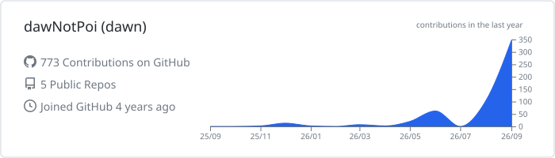

# Hi, I'm Dawn 👋

Building **developer tools, AI coding workflows and agent infrastructure**.

Working mainly with **TypeScript / React / Node.js**, while contributing to open-source projects around **MCP, ACP, coding agents, runtime reliability, Rust and Go systems**.

 

 

  

 

---

## Featured Work

###  [Nubbi](https://github.com/dawNotPoi/Nubbi)

Full-stack knowledge workspace with rich-text notes, file storage, real-time collaboration and an MCP server.

 

###  [Codeg](https://github.com/xintaofei/codeg)

Open-source coding-agent workspace and orchestration layer.

MCP discovery · ACP sessions · tool-call normalization

---

## Activity

  

  
  &nbsp;&nbsp;
  

