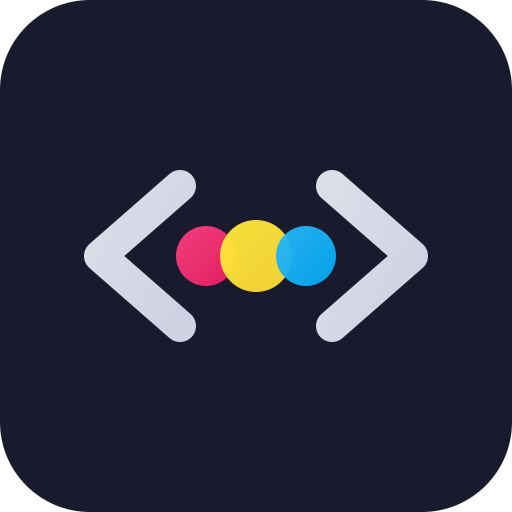
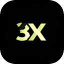
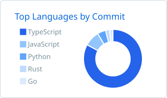
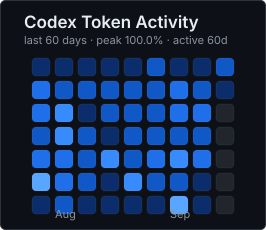

# Hi, I'm Dawn 👋

Building **developer tools, AI coding workflows and agent infrastructure**.

Working mainly with **TypeScript / React / Node.js**, while contributing to open-source projects around **MCP, ACP, coding agents, runtime reliability, Rust and Go systems**.

 

 

---

## Selected Projects

<table>
<tr>
<td width="33%" align="center" valign="top">

#### [PeekPal](https://github.com/dawNotPoi/PeekPal)

A lightweight desktop devtool built around an embedded-browser workflow.

</td>
<td width="33%" align="center" valign="top">

#### [Skills](https://github.com/dawNotPoi/skills)

Composable skills and workflow definitions for AI-assisted development.

</td>
<td width="33%" align="center" valign="top">

#### [Nubbi](https://github.com/dawNotPoi/Nubbi)

Full-stack knowledge workspace with rich-text notes, file storage, real-time collaboration and an MCP server.

</td>
</tr>
</table>

---

## Open Source

<table>
<tr>
<td width="33%" align="center" valign="top">

#### [Codeg](https://github.com/xintaofei/codeg)

Coding-agent workspace and orchestration layer.

MCP discovery · ACP sessions · tool-call normalization

</td>
<td width="33%" align="center" valign="top">

#### [3x-ui](https://github.com/MHSanaei/3x-ui)

Multi-platform Xray management panel.

Frontend · backend · subscription behavior · concurrency fixes

</td>
<td width="33%" align="center" valign="top">

#### [assistant-ui](https://github.com/assistant-ui/assistant-ui)

React infrastructure for AI chat and agent interfaces.

Runtime state · trigger behavior · CI reliability

</td>
</tr>
</table>

---

## Activity

  
  &nbsp;&nbsp;
  

